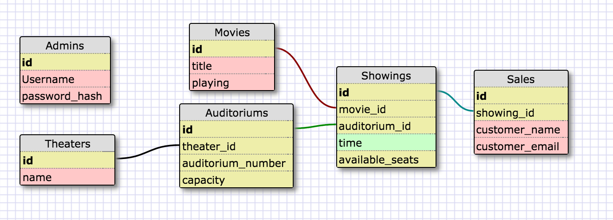

# rails-theater4-2# Rails Theater
Allow users to check movie times and buy tickets to the movies.

Allow managers to manage auditoriums, movie times, and keep track of sales.

# Summary
This project seeks to help movie theater managment manage showings and sales at their movie theaters.

This projects also seeks to make buying tickets easier for users.

Currently CC data is not stored, as a CC processor is needed to handle CC security.

# Design Decisions
## Schema



Users will find a showing that they want to see, enter their information and receive an email confirmation that their order was received. The prompt asked that users only enter their name, email, and CC information at checkout to receive their ticket and email confirmation.

There is no User model, but it could be implemented in the future for users to see which movies they've been to or other information as well as improve the user experience by allowing them not to repeatedly enter their name and email.

By creating a theater model that has many auditoriums it allows for the theater company to scale up the website to multiple locations and continue to use the same web application.

Auditorium model are created for each auditorium and have a maximum seating capacity.

Movie is a model that is used to identify which movie has played at theater. Movies can be played in multiple auditoriums at the same theater so there is a join table called showings.

Showings is a showing of a movie in a specific auditorium and at a specific time. Available seats is a virtual attribute calculated by checking the maximum seating capacity of the auditorium it is in and subtracting the amount of sales that have been made for that showing.

Sales are used to see available seating and for sales data that management might want to see.

Admins are people who would be maintaining the site and adjusting relations between showings, movies, and auditoriums.

## Security
Admin logins need a protected password. I chose to use ActiveModel's has_secure_password because it is built into rails and there will probably be not many additional admin accounts to be created.

Admin creation is also not handled through the web application. It is done on the backend.

If a User model were to be created I would use devise to more adequately protect users and their passwords in the database.


# Future Improvements
After achieving MVP for this project there were definitely things that I could have done better.

* Implementing a system that prevents showing from being created at the same time in the same auditorium.

* Adding lengths of movies so that that variable could be used to prevent multiple showings in the same auditorium until a movie is completed

* Stylizing the website

* Adding a search bar to look for movies at all theater locations

* Writing tests for the controllers

* Add protected sales history requirement

* Add filtering to the sales history section

# Deployment Instructions
```

```
